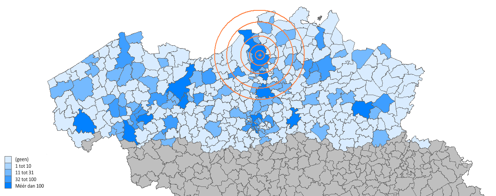

```{r setup, include=FALSE}
knitr::opts_chunk$set(echo = TRUE, cache = TRUE)

set.seed(42)

library(magrittr)
library(data.table)
library(maps)

palette(c("steelblue", "orange", "grey"))
```

## Doel

Zoekopdracht op [VDAB](https://www.vdab.be/) om te onderzoek wat de huidige vraag is naar een TAI profiel. Je kan zulke cijfers zeer gemakkelijk manipuleren, net daarom wensen we in volle transparantie laten zien hoe we aan de cijfers rond VDAB vacatures zijn geraakt zodat iedereen zelf kan oordelenn.

## Methode

### Zoektermen

De zoekopdracht is als volgt:

```txt
AI OR artificieel OR data NOT "data officer" NOT boekhouder NOT commerci* NOT financieel NOT vertegenwoordiger NOT marketing NOT installateur NOT wetenschappen NOT Logistiek NOT Aankoper NOT "onderzoek en ontwikkeling"
```

### filter

In eerste instantie wordt er een filtering doorgevoerd op volgende beroepscategorieën (&ne; vacature titel):

- Analist ontwikkelaar ICT (468)
- Bedrijfsanalist ICT (225)
- Administratief medewerker (161)
- Netwerkbeheerder (143)
- Integratie en implementatie expert ICT (140)
- Databankbeheerder (123)
- Verantwoordelijke ICT (77)

De cijfers tussen haakjes geven telkens het aantal resultaten per beroepscategorie weer

In tweede instantie zal er gefilterd worden op Bachelor diploma^[de VDAB vacatures maakt voorlopig geen onderscheid tussen academische en professionele bachelors].

Na bovenstaande filtering werden de zoekresultaten gekopieerd van de VDAB site. Wegens tijdgebrek is er geen tijd voor het goedgekeurd krijgen van toegang tot de API van de VDAB, dus deze actie is voorlopig manueel uitgevoerd. Na het kopiëren werden alle kruisverwijzingen (in de trend van _vacature wordt ook aangeboden door &hellip;_) verwijderd. Daarna werden elke derde lijn geselecteerd (regex `(^.*?$[\n]){3}`) en werden telkens de twee daaropvolgende lijnen achteraan toegevoegd, gescheiden van een tabulatie-teken. Tenslotten werden het bedrijf en de locatie gescheiden in afzonderlijke velden (" in " &rarr; TAB) alsook de datum in afzonderlijke velden geplaatst.

## Resultaten

### Categorieën en Domeinen

Uitgevoerd op 2021-01-28 om 14:00 gaf de zoekopdracht, ongefilterd 3000+ resultaten. Na het doorvoeren van de boeroepscategorie filter liep dit cijfer terug tot 1197. Niet alle deze gefilterde resultaten zijn relevant voor het Bachelor diploma.

```{r diploma}
plot_freq <- function(x, title) {
  pos <- x[, barplot(Aantal, names.arg = Category,
      col = c(1, 1, 1, 3),
      main = title, yaxt = "n")]
  x[, text(pos, Aantal / 2, Aantal, col = "white")] %>% invisible
}

fread(
"Category	Aantal
  Bachelor	868
  Master	400
  Secundair	115
  Onbekend	215
  ") %>% plot_freq("Diploma")
```

Enkel de vacatures voor Bachelor diploma's worden weerhouden. Binnen deze groep kunnen we onderzoeken binnen welk domein de vacatures zich bevinden:

```{r}
pos <- fread(
"Category	Aantal
ICT	785
Management	126
Administratie	98
Ander	15") %>% plot_freq("Job domein")
```

### Vacature Details

Na het verwerken worden de vacature in een lijst geplaatst waarvan hieronder 25 willekeurige rijen worden getoond:

```{r vacatures}
vdab <- "input.txt" %>% fread(encoding = "UTF-8")
vdab[sample(1:.N, 25)] %>% (kableExtra::kable)

# Opkuis
vdab[Location == "Regio Antwerpen", Location := "ANTWERPEN"]
vdab[, Location := Location %>% toupper]
```

### Vacature Locatie

Op basis van de BelgiumMaps.StatBel data werd onderstaande kaart gecreëerd. Kleuring en legende werden achteraf manueel aangepast (tweede figuur) omdat dit nogal moeizaam is via de `tmap::qtm` functie en omdat logaritmische cijfers vaak moeilijker interpreteerbaar zijn.

```{r}
library(BelgiumMaps.StatBel)
library(sf)
library(tmap)

data(BE_ADMIN_MUNTY)
munip_map <- st_as_sf(BE_ADMIN_MUNTY)
munip_map$TX_MUNTY_DESCR_NL <- munip_map$TX_MUNTY_DESCR_NL %>% toupper
munip_data <- vdab[, .N, Location][order(-N)]

vdab_loc <- merge(munip_map, munip_data,
  by.x = "TX_MUNTY_DESCR_NL",
  by.y = "Location", all.x = TRUE, )

vdab_loc$N <- ifelse(
  vdab_loc$TX_RGN_DESCR_NL == "Waals Gewest", NA,
  ifelse(is.na(vdab_loc$N), 0, 1 + log10(vdab_loc$N)))

qtm(vdab_loc, fill = "N", fill.title = "")
```



```{r}
verh_prov_antw <-
  ((vdab_loc %>% as.data.table)[
    TX_PROV_DESCR_NL == "Provincie Antwerpen", sum(N)]) / 
  ((vdab_loc %>% as.data.table)[,sum(N, na.rm = TRUE)])
```

Uit de data blijkt dat `r verh_prov_antw %>% multiply_by(100) %>% sprintf("%.2f%%", .)` van de vacatures bevinden zich in provincie Antwerpen.

### Lijst van bedrijven in het Antwerpse

```{r}
merge(munip_map, vdab,
  by.x = "TX_MUNTY_DESCR_NL",
  by.y = "Location") %>%
  as.data.table %>%
  extract(TX_PROV_DESCR_NL == "Provincie Antwerpen", Company) %>% 
  unique %>% sort %>% paste0(collapse = "\n") %>% cat
```

### Lijst vacature-titels

Door de wildgroei aan titels in vacatures is het moeilijk om door het bos de bomen te zien en op wetenschappelijk accurate uitspraken te doen. Wat wel kan is een eenvoudige netwerk analyse waarbij het de associatie van de termen uit de vacatures in kaart worden gebracht. We kunnen de aanpak samenvatten als volgt:

- Selecteer alle opgekuiste termen die betrekking hebben op de inhoud (erg veel bedrijfsnamen sluipen door in de vacature omschrijving)
- Breng verwante termen onder dezelfde noemer
- Groepeer de termen volgens de domeinen

Het resultaat kan niet rechtstreeks in dit PDF document getoond worden omdat het om een interactief krachtnetwerk gaat dat enkel in HTML goed weergegeven kan worden (zie interactieve versie [hier](https://ddhaese.github.io/Project_AI_Jobs/)).

```{r eval = TRUE}
posit <- vdab[, .N, Position][order(Position)]
posit_repl <- fread("posit_replace.tsv", sep = "\t")
posit_excl <- fread("posit_exclude.tsv", sep = "\t")
posit_grps <- fread("posit_groups.tsv", sep = "\t")

normalize <- function(x) {
  x_min <- min(x, na.rm = TRUE)
  x_max <- max(x, na.rm = TRUE)
  
  (x - x_min) / (x_max - x_min)
}

library(tm)
library(stringr)
library(quanteda)

posit_dfm <- posit$Position %>%
  toupper %>%
  gsub("-", " ", .) %>%
  gsub("[^A-Z ]", "", .) %>%
  stripWhitespace %>%
  trimws %>% 
  tokens(remove_punct = TRUE, remove_numbers = TRUE, remove_symbols = TRUE) %>% 
  tokens_remove(posit_excl$To_Delete, padding = TRUE) %>% 
  tokens_remove(min_nchar = 2, padding = TRUE) %>% 
  tokens_replace(posit_repl$From, posit_repl$To, valuetype = "fixed") %>% 
  as.list %>% 
  lapply(paste, collapse = " ") %>% 
  trimws %>%
  dfm(tolower = FALSE) %>% 
  dfm_trim(min_termfreq = 3, min_docfreq = 2)

stopifnot(posit_dfm@Dim[2] < 500)

posit_cooc <- t(posit_dfm) %*% posit_dfm %>% as.matrix
posit_dist <- posit_cooc %>% normalize %>% add(-1) %>% abs

dist_to_net <- function(x, groups = rep("A", nrow(x)),
  group_colors = c("A" = "steelblue"), node_sizes = rep(1, nrow(x)),
  aggr = max, legend = TRUE, fontsize = 14, charge = -400) {
  
  library(networkD3)
  library(htmlwidgets)
  library(assertthat)
  
  stopifnot(are_equal(colnames(x), rownames(x)))
  
  x_nodes <- data.table(NodeID = colnames(x), Group = groups,
    Nodesize = node_sizes)
  
  x_links <- data.table(
      Source = c(col(x) - 1),
      Target = c(row(x) - 1),
      Dist = c(x))
  
  x_links[, Combination := c(.SD$Source, .SD$Target) %>%
      sort %>% paste0(collapse = "_"), 1:nrow(x_links)]
  
  x_links <- x_links[, .(Source = Source[1], Target = Target[1],
    Dist = aggr(Dist)), Combination]
  
  x_links[, Combination := NULL]
  x_links <- x_links[Dist < 1]
  
  color_scale <- paste0(
    "d3.scaleOrdinal().domain([\"",
    groups %>% unique %>% sort %>% paste0(collapse = "\", \""),
    "\"]).range([\"", 
    group_colors[groups %>% unique %>% sort] %>% unname %>%
      paste0(collapse = "\", \""), "\"]);")
  
  force_network <- forceNetwork(
    height = 600,
    width = 900,
    Links = x_links,
    Nodes = x_nodes, 
    Source = "Source",,
    Target = "Target", 
    NodeID = "NodeID",
    Group = "Group",
    Nodesize = "Nodesize", 
    bounded = TRUE,
    opacityNoHover = .8,
    linkColour = "#E0E0E0",
    zoom = TRUE,
    colourScale = JS(color_scale),
    legend = legend,
    fontFamily = "Calibri",
    fontSize = fontsize,
    charge = charge,
    opacity = 1,
    linkDistance=JS('function(d) {', 'return d.linkdist;', '}'))
  
  force_network$x$links$linkdist <- x_links$Dist
  force_network
}

groups <-  rep("OTHER", nrow(posit_dist))
groups[which(colnames(posit_dist) %in% posit_grps$Term)] <-
  posit_grps$Group

group_colors <- c(
  "BUSINESS" = "purple",
  "COMMON" = "grey",
  "DATA" = "orange",
  "IOT" = "steelblue",
  "OTHER" = "lightgrey",
  "SECURITY" = "red",
  "SOFTWARE" = "green"
  )

posit_dist %>%
  dist_to_net(groups = groups, group_colors = group_colors)
```
